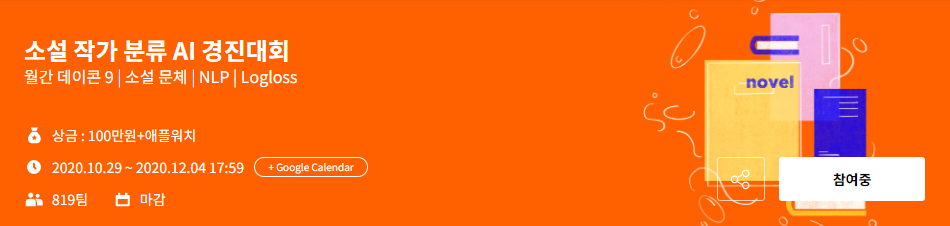

# 소설 작가 분류 AI 경진대회

- [대회 바로가기](https://www.dacon.io/competitions/official/235670/overview/description/)

소설 작가 분류 AI 경진대회 대회 제작 경과

   

## 대회 소개 (Introduction)

- 소설 속 문장뭉치 분석을 통한 저자 예측

- a. 작가의 글을 분석하여 특징 도출
- b. 취향 추천 시스템 활용 / 대필, 유사작 탐지

## 주최/주관

- 주최: DACON
- 주관: DACON
- 후원: 이노베이션 아카데미

## 규칙

1. 심사 기준: LogLoss
2. 외부 데이터 및 사전 학습 모델

* 외부 데이터 사용이 불가합니다. 
* 사전 학습 모델(pre-trained Model) 사용이 불가합니다.

## 목차 (Table of Contents)

**개발 단계** - raw_data부터 대회용 데이터까지의 경과

1. [대회 개발](./1. Develop)
2. [대회 데이터](./2. Data)

**베이스라인** - 참여자들의 제출을 가능케하는 데이콘 베이스라인

3. [베이스라인](./3. Baseline)

**정답 코드** - 데이콘이 제시하는 정답코드

4. [정답 코드] (./4. Answer_code)

